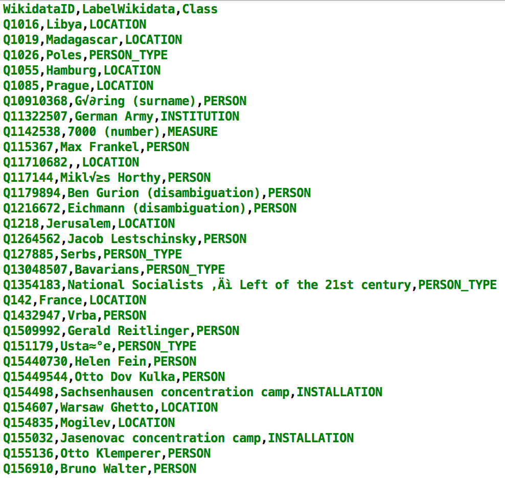

# <font color="blue"> NERD_KID </font> :neckbeard:

This project will focus on machine learning for classifying items found in Wikidata into 27 classes in Nerd, for instance, Institution, Location, Person.

# Goal
According to [Wikidata's statistics](https://www.wikidata.org/wiki/Special:Statistics), more than 29 million items can be found in Wikidata. With its rich and open knowledge base, it's interesting to learn how those items can be classified into 27 classes. These classes are based on [Grobid-NER](http://grobid-ner.readthedocs.io/en/latest/class-and-senses/) 's project results.

The idea of this project is to make computers <font color="red"> understand </font> how grouping millions of items in Wikidata into specific classes based on their data characteristics.

Let's take an example of an item [Albert Einstein](https://www.wikidata.org/wiki/Q937) in Wikidata which has an identifier 'Q937'. This item actually has a number of properties (e.g. 'instance of-P31', 'sex or gender-P21', etc.) as well as a number of values for each property (e.g. 'human-Q5' as a value of property 'P31', 'male-Q6581097' as a value of property 'P-21'). Based on a trained given model, computers will understand how making some predictions and classifying the Albert Einstein's item into a certain class, Person class, for instance. This project will also consider disambiguity of items. For instance, computers will not classify [Marshall Plan](https://www.wikidata.org/wiki/Q4576) into a Person class, because it's not a name of a person, rather it's an American initiative to aid Western Europe. 


# Tools


# Data from Grobid-Ner's Project

*As base model (model0), this project use data from Grobid-Ner's project by collecting their mentions and classes*

These files can be extracted from [Grobid-Ner](https://github.com/kermitt2/grobid-ner/tree/master/grobid-ner/resources/dataset/ner/corpus/xml/final)
and can be copied into `data/xml/annotatedCorpus.xml`

After copy the file, the mentions and classes can be extracted by this service

```$ mvn exec:java -Dexec.mainClass="org.nerd.kid.preprocessing.GrobidNERTrainingDataTransformer"```

The result can be seen in `data/csv/GrobidNer/annotatedCorpusResult.csv`

# Installation-Build-Run
**1. Installation**

*a. Clone this source* 

```$ git clone https://github.com/tantikristanti/NERD_KID.git```

*b. Download the zip file*

[NERD_KID](https://github.com/tantikristanti/NERD_KID/archive/master.zip)

**2. Build the project**

```$ mvn clean install```

**3. Prepare new data**

New data can be extracted by accessing the API of Nerd or Entity-Fishing.*

```$ mvn exec:java -Dexec.mainClass="org.nerd.kid.extractor.MainRestAPINerdCaller"```

- It is possible to change the whole part of query or just the part of text. 
(read further explanation about Nerd's REST API in [Entity-Fishing](http://nerd.readthedocs.io/en/latest/restAPI.html))

- The example of how to enter the correct URL and Query can be seen in "data/example/exampleCurlNERD.txt"

*( The raw result extracted from API in JSON format can be seen in `/data/json/Result_NERDDataExtractor.json`)*

- The result of list of Wikidata Ids and Classes can be seen in `/data/csv/NewElements.csv`. 
It is a very simple csv file that contain Wikidata Id and their classes. For example:

```
WikidataID,Class
Q76,PERSON
Q1408,LOCATION
```
**4. Build a training file**
- In order to build a new training data, this service can be used:

```$ mvn exec:java -Dexec.mainClass="org.nerd.kid.arff.MainTrainerGenerator"```

*(Basically, a training file built based on the datasets prepared in `data/csv/BaseElements.csv`
 This step is done if there isn't any training file or there is a need to build a new one.)*

- It is also possible to add new data into training file that already exist. 
  This new data can be put in `data/csv/NewElements.csv`, then run the service:

```$ mvn exec:java -Dexec.mainClass="org.nerd.kid.arff.AddDataTrainerGenerator"```

- The result can be seen in `result/arff/Training.arff`

*Note :* 
- CSV files must have at least the header `WikidataID` and `Class`. So:

```
WikidataID,labelWikidata,Class
Q3318231,Joko Widodo,PERSON
...
```

or

```
WikidataID,Class
Q76,PERSON
...
```

are in correct format.

- Error in this step can appear if certain element's Id is no longer available in Wikidata. 
 Just delete the Id that want to be processed from the CSV files.
  
**5. Train the model**

*Model training using Random Forest classification [SMILE](https://github.com/haifengl/smile/)*

```$ mvn exec:java -Dexec.mainClass="org.nerd.kid.model.MainModelBuilder"```

- Input needed is the percentage of training-testing splitting data, e.g. `80` (%)
- Result can be seen in `result/txt/Result_Trained_Model.txt`
- The machine learning model itself (the result of Random Forest algorithm) can be found in the temporary file `tmp/model.xml`
    It can be copied 

**6. Get new predicted classes**

```$ mvn exec:java -Dexec.mainClass="org.nerd.kid.rest.MainCallAPIWikidata"```

- The result of predicted class can be seen in `result/Predicted_Testing.csv`

**7. Example of the use**

*Prepare the list of Wikidata Id*

Firstly, prepare the list of new Wikidata Id that need to be predicted (in this case, Nerd_kid will predict the class for each Wikidata Id prepared)
The list then can be copied into `data/preannotation/dataPreannotation.csv`.
It is a very simple csv file that contain Wikidata Id for each line without name of label and Null for the class. For example:
```
WikidataID,Class
Q76,PERSON
Q1408,LOCATION
```

*To predict Wikidata Id:*
- It is possible also to change the training data located in `data/Training.arff`
- Run the service of prediction :

```$ mvn exec:java -Dexec.mainClass="org.nerd.kid.preannotation.MainPreAnnotation"```

*The example of result can be seen in the picture*


*Build new datasets by integrating with new data*
```$ mvn exec:java -Dexec.mainClass="org.nerd.kid.rest.MainTrainer"```

- Input is in csv format, default in /data/corpus/csv

Format the csv file. The label can be empty and the class can be `Null`, for example:

```
WikidataID;labelWikidata;PredictedClass
Q1016;Libya;Null
Q11322507;;Null
```

## Contact

Contact: Tanti Kristanti (<tantikristanti@gmail.com>)

