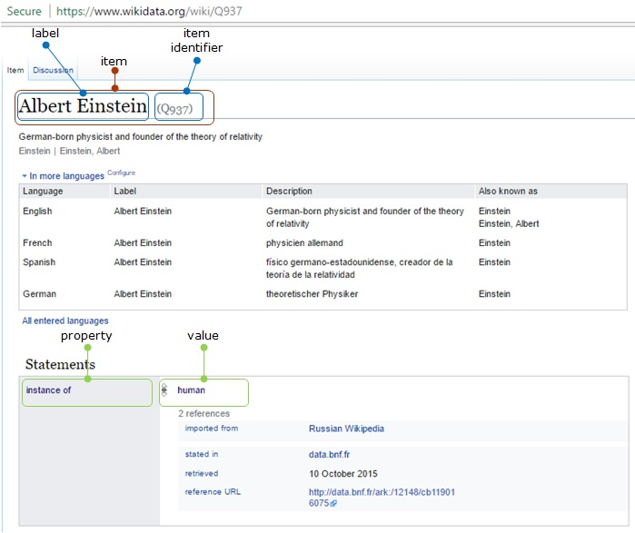
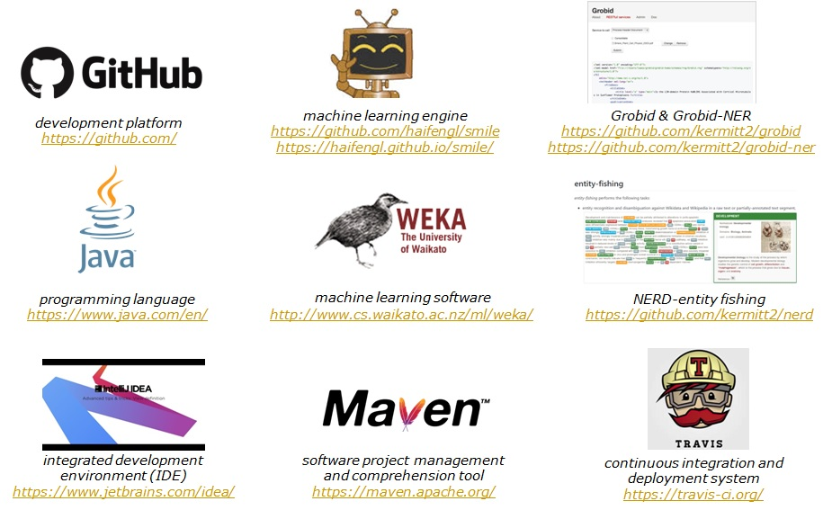
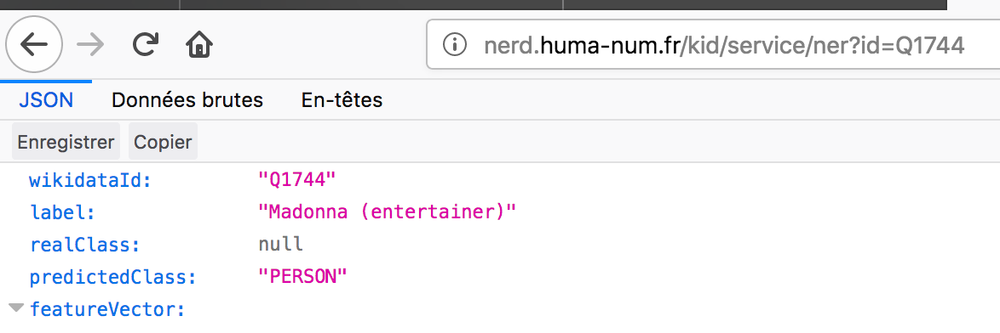

# <font color="blue"> NERD_KID </font> :neckbeard:

This project focuses on machine learning for classifying items found in Wikidata into 27 classes in Nerd, for instance, Institution, Location, Person.

# Goal
According to [Wikidata's statistics](https://www.wikidata.org/wiki/Special:Statistics), more than 49 million items can be found in Wikidata. With its rich and open knowledge base, it's interesting to learn how those items can be classified into 27 classes. These classes are based on [Grobid-NER](http://grobid-ner.readthedocs.io/en/latest/class-and-senses/) 's project results.

The idea of this project is to make computers <font color="red"> understand </font> how grouping millions of items in Wikidata into specific classes based on their data characteristics.

Let's take an example of an item [Albert Einstein](https://www.wikidata.org/wiki/Q937) in Wikidata which has an identifier 'Q937'. This item actually has a number of properties (e.g. 'instance of-P31', 'sex or gender-P21', etc.) as well as a number of values for each property (e.g. 'human-Q5' as a value of property 'P31', 'male-Q6581097' as a value of property 'P-21'). Based on a trained given model, computers will understand how making some predictions and classifying the Albert Einstein's item into a certain class, Person class, for instance. This project will also consider disambiguity of items. For instance, computers will not classify [Marshall Plan](https://www.wikidata.org/wiki/Q4576) into a Person class, because it's not a name of a person, rather it's an American initiative to aid Western Europe. 



# Tools



# Installation-Build-Run
**1. Installation**

*a. Clone this source* 

```$ git clone https://github.com/tantikristanti/NERD_KID.git```

*b. Download the zip file*

[NERD_KID](https://github.com/tantikristanti/NERD_KID/archive/master.zip)

**2. Build the project**

```$ mvn clean install```


**3. Build a training Arff file**
- In order to build a new training data, this service can be used:

```$ mvn exec:java -Dexec.mainClass="org.nerd.kid.arff.TrainerGenerator"```

*(Basically, a training file built based on the datasets prepared in  
 This step is done if there isn't any training file or there is a need to build a new one.)*

- The result of Arff file can be seen in  
- It is also possible to check first whether the data and features of wikidata Ids are correct/complete by checking the Csv file result located in   
  
**4. Build, train, and evaluate the model**

*Model training using Random Forest classification [SMILE](https://github.com/haifengl/smile/)*

```$ mvn exec:java -Dexec.mainClass="org.nerd.kid.model.ModelBuilder"```

- The evaluation result can be seen in  
- The model itself can be found in Xml and Zip format which are located in the temporary file `/tmp` and they can be copied to  directory

**5. Prepare new data to be predicted**
The prediction service provided by Nerd-Kid can be done if the list of new Wikidata Id is available in .
In order to do so, there are some possibilities of:
    a. Filling manually the list of Wikidata Ids and their Classes  
    
   The file is actually a very simple csv file that contain Wikidata Id and just leave the Class empty with comma separator. For example:
    
    ```
    WikidataID,Class
    Q76,
    Q1408,
    ```
    
   b. If some texts are available, using Nerd and Grobid-Ner service to get Wikidata Ids and their Classes 
     
   *New data can be collected by extracting the text with the text disambiguation service of [Entity-Fishing](http://nerd.readthedocs.io/en/latest/restAPI.html)*
    
   - Firstly, the ***text*** and the ***language*** need to be input in order to get some mentions and disambiguation results in Json format
        - The example of the text can be seen here  
        - If the language is not mentioned, the text will be processed as English text by default.
        - The raw Json result from Entity-Fsihing can be seen in  
        
   - Secondly, the result from the previous step will be parsed in order to get a list of Wikidata Ids and their classes
        - The list of Wikidata Ids and Classes can be seen in  
        - It is a very simple csv file that contain Wikidata Ids and their classes. For example:
        
    ```
    WikidataID,Class
    Q76,PERSON
    Q1408,LOCATION
    ```

   These 2 tasks can be done by this service:
    ```$ mvn exec:java -Dexec.mainClass="org.nerd.kid.service.NerdClient"```

**5. Get the prediction results**

To predict each Wikidata Id prepared in , this service can be called:


```$ mvn exec:java -Dexec.mainClass="org.nerd.kid.model.WikidataNERPredictor"```

- The result can be seen in 


**6. Web version**

For testing purposes, Nerd-Kid is available here [Nerd-Kid](http://nerd.huma-num.fr/kid/service/ner?id=Q1) 

User can only just change the Wikidata Id started with 'Q' and then the number.



- The result will be Wikidata Id, the properties, and the result of predicted class.

## Reference

For citing this work, please simply refer to the Github project:

```Nerd-Kid (2017-2018) <https://github.com/tantikristanti/NERD_KID>```


## Contact

Contact: Tanti Kristanti (<tantikristanti@gmail.com>)


